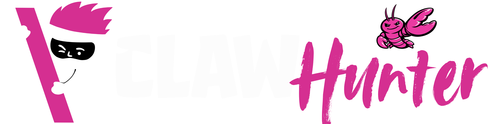
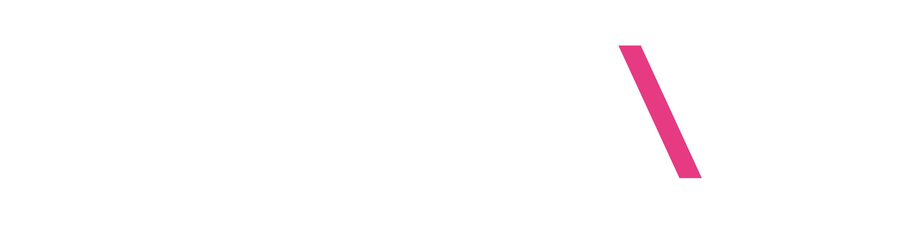

<p align="center">
    <picture>
        <source media="(prefers-color-scheme: light)" srcset="./claw-white.png" width="600">
        
    </picture>
</p>

<h1 align="center">
  🦞 Claw Hunter 🦞 by Backslash Security
    
[](https://opensource.org/licenses/MIT)
[](https://www.gnu.org/software/bash/)
[](https://docs.microsoft.com/en-us/powershell/)

</h1>

<p align="center">
  <strong> Let us guess, your developers are not running OpenClaw, are they? 👀 </strong>
</p>

<p align="center">
  <b>Claw Hunter</b> is a discovery and risk-assessment tool for <b>OpenClaw</b> (formerly known as Clawdbot and Moltbot) instances. It identifies "Shadow AI", audits agent privileges. It let's you (the user) ensure that your user endpoints, data and network are not compromised by unauthorized access.
</p>


<p align="center">
  <a href="https://backslash.security/">
      <picture>
    <source media="(prefers-color-scheme: light)" srcset="./icon-white.png" width="300">
    
  </picture>
  </a>
</p>


## 🛡️ Why it matters for Security Teams

In the 2026 landscape, autonomous agents like OpenClaw operate as high-privilege service accounts. While they boost productivity, they often bypass standard IAM policies, creating "Shadow AI" instances that can execute shell commands and move data across your network.

**Claw Hunter** is purpose-built for **ITSec teams** to detect:

* **Security Risks**: Shell access, filesystem write permissions, exposed gateways
* **Credential Exposure**: Scans for potential secrets and API keys
* **Integration Inventory:** Active agents, channels, and registry entries
* **Configuration Issues**: Missing auth tokens, misconfigured services
* **Installation Status**: CLI, config files, running processes


## ✨ Core Capabilities

* ✅ **System Agnostic Visibility:** macOS, Linux (bash 3.2+), Windows (PowerShell 5.1+)
* ✅ **MDM-Ready**: Silent execution, proper exit codes, centralized logging
* ✅ **Non-Intrusive**: Read-only operations, no system modifications
* ✅ **Comprehensive Detection**: Installation, configuration, processes, secrets
* ✅ **Structured Output**: JSON format for automation and SIEM integration
* ✅ **Zero Dependencies**: Pure bash/PowerShell, optional `jq` for enhanced JSON
  
### MDM Integration
- 🔒 Silent execution mode for automated deployment
- 📊 Machine identification (hostname, serial number, timestamp)
- 🎯 Security risk scoring (clean, warning, critical)
- 📤 Upload results to central API endpoint
- 🔐 Bearer token authentication support
- 📝 Persistent logging to standard locations
- ✅ Proper exit codes for automation

### Exit Codes
- `0`: No issues detected (clean)
- `1`: Security issues or warnings found
- `2`: OpenClaw not installed
- `3`: Script execution error

## 🚀 Quick Start

### Interactive Mode (Manual Audit)

**macOS/Linux:**
```bash
# Download and run
curl -O  https://raw.githubusercontent.com/backslash-security/Claw-Hunter/main/claw-hunter.sh
chmod +x claw-hunter.sh
./claw-hunter.sh
```

**Windows:**
```powershell
# Download and run
Invoke-WebRequest -Uri  https://raw.githubusercontent.com/backslash-security/Claw-Hunter/main/claw-hunter.ps1 -OutFile claw-hunter.ps1
.\claw-hunter.ps1
```

### MDM Deployment (Automated)

**Jamf Pro (macOS):**
```bash
sudo /path/to/claw-hunter.sh --mdm --upload-url https://your-api.com/audits --api-key-file /etc/openclaw-key
```

**Microsoft Intune (Windows):**
```powershell
.\claw-hunter.ps1 --mdm --upload-url https://your-api.com/audits
```

See [MDM Deployment Guides](docs/mdm-guides/) for platform-specific instructions.

## 📖 Usage

### Command-Line Options

```bash
./claw-hunter.sh [OPTIONS]

Options:
  --json                   Print JSON output to terminal (stdout)
  --json-path <file>       Save JSON results to this file path
  --mdm                    MDM mode: silent execution with JSON output
  --upload-url <url>       Upload JSON results to this URL
  --api-key-file <file>    File containing API key for authentication
  --log-file <file>        Write logs to this file
  -h, --help               Show help message

MDM Mode:
  Silent execution designed for automated deployment via MDM platforms.
  - Suppresses terminal output (errors go to stderr)
  - Writes JSON to /var/log/claw-hunter.json (Unix) or C:\ProgramData\claw-hunter.json (Windows)
  - Logs to corresponding .log file
  - Returns proper exit codes for automation
```

### Examples

```bash
# Interactive mode with terminal output
./claw-hunter.sh

# Save results to JSON file
./claw-hunter.sh --json-path /tmp/audit-results.json

# Print JSON to stdout
./claw-hunter.sh --json

# MDM deployment with upload
sudo ./claw-hunter.sh --mdm --upload-url https://api.example.com/audits --api-key-file /etc/audit-key

# MDM with custom paths
sudo ./claw-hunter.sh --mdm --json-path /custom/audit.json --log-file /var/log/custom.log
```

## 📊 Output Format

### Terminal Output (Interactive Mode)
```
==========================================
🛡️  OPENCLAW SECURITY AUDIT: UNIX/MAC (v3)
==========================================

--- [ Detection ] ---
✅ State Dir: /Users/john/.openclaw
✅ Config: /Users/john/.openclaw/openclaw.json (found)
✅ CLI: /usr/local/bin/openclaw (v1.2.3)

--- [ Network & Gateway ] ---
⚡ Gateway: ACTIVE (Port 18789 | PID: 12345)
⚠️  Gateway auth token: NOT SET

--- [ Privileges & Tools ] ---
❗ RISK: Shell Access ENABLED
✅ Filesystem Write: not flagged
```

### JSON Output (MDM Mode)
```json
{
  "mdm_mode": true,
  "mdm_metadata": {
    "hostname": "LAPTOP-ABC123",
    "serial_number": "C02XYZ123456",
    "timestamp": "2026-02-02T20:30:00Z",
    "script_version": "3.0"
  },
  "security_summary": {
    "risk_level": "warning",
    "critical_issues": 1,
    "warnings": 2,
    "info_items": 5
  },
  "platform": "unix",
  "os": "macos",
  "cli_installed": true,
  "cli_version": "1.2.3",
  "gateway_running": true,
  "gateway_token_set": false,
  "risk_shell_access_enabled": true,
  "secrets_found": false
}
```

See [examples/](examples/) for complete output samples.

## 🔧 Requirements

### Bash Script (macOS/Linux)
- Bash 3.2 or higher (pre-installed on macOS/most Linux)
- Standard Unix utilities: `grep`, `awk`, `sed`, `find`
- Optional: `jq` for enhanced JSON formatting
- Root/sudo access for MDM mode (for serial number access)

### PowerShell Script (Windows)
- PowerShell 5.1 or higher (Windows 10/11)
- No additional dependencies
- Administrator privileges recommended for MDM mode

## 🧪 Testing

Run the test suite to verify functionality:

```bash
# Bash tests
cd tests/bash
./run-tests.sh

# PowerShell tests
cd tests/powershell
.\run-tests.ps1
```

See [tests/README.md](tests/README.md) for detailed testing documentation.

## 📝 License
Distributed under the MIT License. see the [LICENSE](LICENSE) file for details.

## ⚖️ Legal Disclaimer

**Claw Hunter** is an independent security research tool. We are **not affiliated, associated, authorized, endorsed by, or in any way officially connected** with OpenClaw (formerly Moltbot) or any of its subsidiaries or its affiliates. The name OpenClaw as well as related names, marks, emblems, and images are registered trademarks of their respective owners.

## ⚠️ Disclaimer

This tool performs read-only security audits and does not modify system configurations. Always test in a non-production environment first. The tool detects potential security issues but does not make judgments about your specific security requirements. <br/>
[Security Considerations](security.md) - What the audit detects and why


## 🤝 Contact & Support

For security disclosures, enterprise support, or general inquiries, please reach out to the team.

* 🌐 **Website:** [backslash.security](https://backslash.security/)


## 🩷 Acknowledgments

* All the contributors making AI safer every day.
* Maintained with ❤️ by the team at **Backslash Security**.
* Special thanks to the security researchers documenting the evolution of autonomous agent persistence.
* Don't forget to <strong> Vibe Safely! </strong>

  <p align="center">
    
    
  </p>
